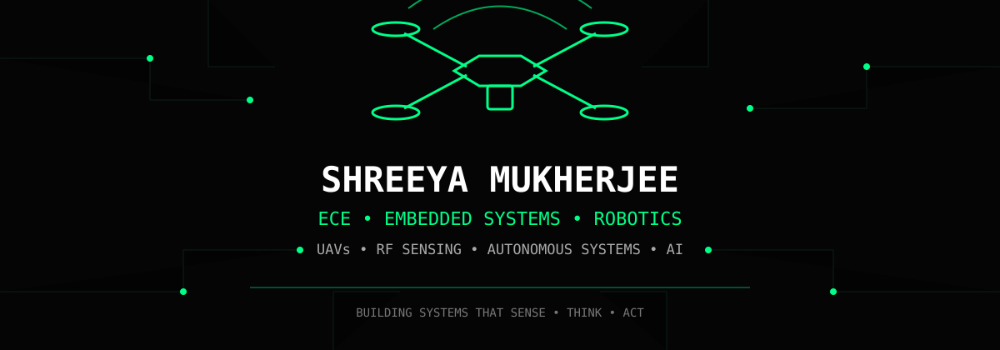
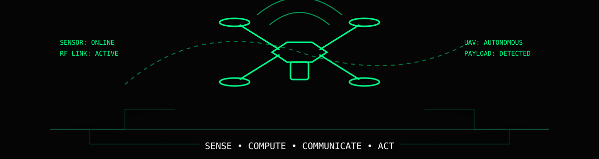

<!-- ========================= -->

<!--        HERO SECTION       -->

<!-- ========================= -->

  

 

  

 

  

 

  

 

  

<!-- ========================= -->

<!--       INTRODUCTION        -->

<!-- ========================= -->

<h2 align="center">
  🤖 Building Systems That Sense • Think • Act
</h2>

  <b>
    ECE Embedded Systems • Robotics • UAVs • RF Sensing • Autonomous Systems
  </b>

 

<h2 align="center">🛠️ Tech Stack</h2>

  <i>Languages, frameworks, platforms and tools I use to build intelligent robotic systems</i>

 

  

 

  
  
  
  
  

 

  
  
  
  
  
  

