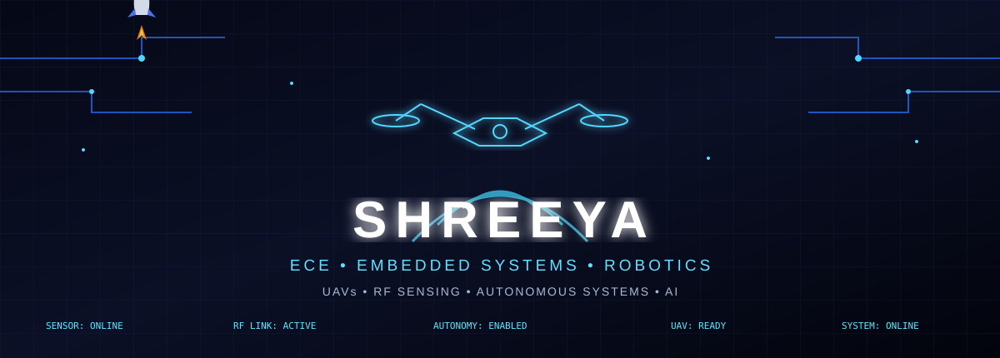

<!-- ========================================================= -->
<!--                     SHREEYA MUKHERJEE                    -->
<!--              ECE • EMBEDDED • ROBOTICS                   -->
<!-- ========================================================= -->

<p align="center">
  
</p>

<p align="center">
  <b>ECE • Embedded Systems • Robotics • Autonomous Systems</b>
</p>

<p align="center">
  <i>
    Building intelligent systems across hardware, sensing,
    communication, embedded control and autonomous decision-making.
  </i>
</p>

<br>

<!-- ========================================================= -->
<!--                    QUICK IDENTITY                        -->
<!-- ========================================================= -->

<p align="center">
  
</p>

<br>

<p align="center">
  
</p>

---

# 👩‍💻 About Me

I'm an **Electronics & Communication Engineering student** focused on **Embedded Systems, Robotics and Autonomous Systems**.

I enjoy building systems where **hardware, software, sensing and intelligent algorithms** work together — from embedded controllers and ROS 2 robots to autonomous UAV systems and RF-based sensing.

My current technical direction combines:

- 🤖 Robotics & Autonomous Systems
- 🛩️ UAV Systems & Embedded Control
- 📡 RF Sensing & Wireless Localization
- 🔌 Embedded Systems & Microcontrollers
- 🧠 AI / ML for Intelligent Systems
- 🌐 UAV Communication & Networking

> **My goal:** build reliable engineering systems that can sense their environment, communicate, make decisions and act autonomously.

---

# 🎯 Engineering Focus

<table align="center">
<tr>

<td align="center" width="25%">

### 🤖 Robotics

ROS 2  
Autonomous Navigation  
Obstacle Avoidance  
Sensor Integration  
Motion Planning

</td>

<td align="center" width="25%">

### 🛩️ UAV Systems

PX4  
Embedded Control  
Payload Systems  
Autonomous Flight  
UAV Networking

</td>

<td align="center" width="25%">

### 📡 RF & Sensing

RF Sensing  
Wi-Fi CSI  
RSSI Localization  
Wireless Communication  
UAV Communication

</td>

<td align="center" width="25%">

### 🧠 Intelligent Systems

Python  
PyTorch  
Computer Vision  
Machine Learning  
AI for Robotics

</td>

</tr>
</table>

---

# 🚀 Featured Engineering Projects

<table align="center">

<tr>

<td width="50%" valign="top">

## 🛩️ Payload-Aware Autonomous UAV

An autonomous UAV delivery system exploring the engineering challenges of payload-aware flight.

**Focus**

- Payload mass and center of mass
- Thrust requirements
- Battery discharge
- Autonomous navigation
- Payload release mechanism
- Return-to-home behaviour
- Future intelligent control

**Technologies**

`PX4` `ROS 2` `Embedded Systems` `UAV`

</td>

<td width="50%" valign="top">

## 📡 UavNetSim

An independent implementation and study of UAV network simulation concepts.

**Focus**

- UAV communication
- Dynamic routing
- Q-Routing
- Packet delivery
- Network simulation
- Routing behaviour analysis

**Technologies**

`Python` `Networking` `UAV` `Routing` `Simulation`

</td>

</tr>

<tr>

<td width="50%" valign="top">

## 🤖 ROS 2 Autonomous Robot

A from-scratch obstacle avoidance system for a mobile robot.

**Focus**

- LiDAR `/scan`
- Velocity control `/cmd_vel`
- Local obstacle representation
- Vector-field based navigation
- RViz visualization
- Gazebo simulation

**Technologies**

`C++` `ROS 2` `RViz` `Gazebo`

</td>

<td width="50%" valign="top">

## 🚆 TRAILBLAZER

A railway forecasting system designed to estimate dynamic train arrival times from large-scale railway movement data.

**Focus**

- Train movement data
- Dynamic ETA prediction
- Machine learning
- Real-time replay
- Interactive map visualization

**Technologies**

`Python` `ML` `GRU` `WebSocket` `Maps`

</td>

</tr>

</table>

---

# ⚙️ Technology Stack

### Programming Languages

<p align="center">
  
</p>

### Embedded & Hardware

<p align="center">
  
</p>

<p align="center">
  <b>ESP32 • Arduino • Microcontrollers • Embedded Control • Sensors</b>
</p>

### Robotics & Simulation

<p align="center">
  
</p>

<p align="center">
  <b>ROS 2 • PX4 • Gazebo • RViz • OpenCV • UAV Systems</b>
</p>

### Development & Engineering Tools

<p align="center">
  
</p>

<p align="center">
  <b>Linux • Git • GitHub • VS Code • CMake • Docker • PlatformIO</b>
</p>

### AI / Scientific Computing

<p align="center">
  <b>PyTorch • MATLAB • Machine Learning • Computer Vision • Data Analysis</b>
</p>

---

# 📡 Current Technical Exploration

I'm currently developing deeper knowledge in:

```text
RF Sensing
     ↓
Wi-Fi CSI / RSSI
     ↓
Wireless Localization
     ↓
Robotic Perception
     ↓
Autonomous Decision Making
     ↓
UAV Communication
     ↓
Embodied & Intelligent Robotics
Areas I'm particularly interested in
RF sensing for robotics
Wireless localization
Wi-Fi CSI / RSSI based perception
UAV communication networks
Dynamic aerial routing
Embedded AI
Sensor-driven autonomy
Swarm robotics
Autonomous UAV systems
🧩 Engineering Approach

I believe good robotics systems are built by connecting multiple engineering layers:

<table align="center"> <tr> <td align="center">
01
Sense

Sensors
LiDAR
RF
IMU
Camera

</td> <td align="center">
02
Compute

Embedded
C / C++
Python
AI / ML

</td> <td align="center">
03
Communicate

ROS 2
Wireless
UAV Networks
Telemetry

</td> <td align="center">
04
Act

Control
Navigation
Planning
Autonomy

</td> </tr> </table> <p align="center"> <b>SENSE → COMPUTE → COMMUNICATE → DECIDE → ACT</b> </p>
📚 Currently Learning
<table align="center"> <tr> <td align="center">

🤖
<b>Advanced Robotics</b>

ROS 2
Navigation
Planning
Sensor Fusion

</td> <td align="center">

🛩️
<b>UAV Systems</b>

PX4
Flight Control
Communication
Autonomy

</td> <td align="center">

📡
<b>RF Sensing</b>

CSI
RSSI
Localization
Wireless Systems

</td> <td align="center">

🧠
<b>Reinforcement Learning</b>

RL Fundamentals
Q-Learning
Decision Making
Robotics

</td> </tr> </table>

📊 GitHub Activity
<p align="center"> <i> Building consistently, learning continuously and turning concepts into working systems. </i> </p> <p align="center">  </p>

GitHub's native contribution graph below the profile README remains the primary activity view.

🎨 GitHub Artwork
<p align="center">  </p>
🤝 Let's Connect
<p align="center"> <a href="https://github.com/sorashree">  </a> <!-- Replace YOUR_LINKEDIN_USERNAME with your actual LinkedIn username --> <a href="https://www.linkedin.com/in/YOUR_LINKEDIN_USERNAME/">  </a> <!-- Replace YOUR_EMAIL with your email address --> <a href="mailto:YOUR_EMAIL">  </a> </p>
<p align="center">
🚀 Building the future, one system at a time.

<b>ECE • Embedded Systems • Robotics • UAVs • RF Sensing • Autonomous AI</b>

</p> <p align="center"> <i>Sense • Compute • Communicate • Decide • Act</i> </p>
<!-- ========================================================= --> <!-- END --> <!-- ========================================================= -->
